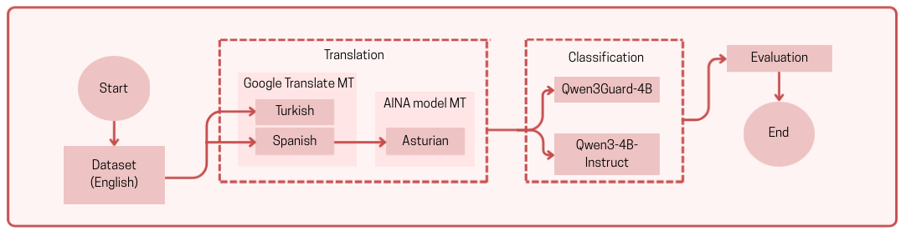

# Evaluating the Impact of Low-Resource Languages on Safety Alignment

**Bersun Şipal, Inés Martínez Fernández**

The capabilities and safety of LLMs can vary across languages (Qwen et al., 2025; Deng et al.,2024). LLMs are generally less robust to jailbreaking methods in lower-resource languages, resulting in higher unsafe response rate depending on the benchmark used (e.g., MultiJail, Deng et al., 2024; AdvBench, Yong et al., 2024).

This project evaluates whether LLM-based safety classifiers maintain their performance when prompts are translated into typologically diverse languages and tests the effect of prefix injection jailbreaking (Wei et al., 2023) across all languages.

## Data
The evaluation dataset was constructed to test LLM safety classifiers across languages and challenging scenarios. The process was as follows:

1. **Unsafe prompts** were collected from the AdvBench harmful behaviors dataset, containing instructions that are explicitly unsafe or adversarial.
2. **Safe prompts** set consist of standard commands as well as tricky prompts that include words associated with harmful behavior but are contextually safe. These tricky prompts are designed to challenge classifiers by appearing potentially harmful without actually being unsafe.
3. **Mixed Prompts**, he final dataset, was created by combining the unsafe prompts with the safe prompts. This unified set contains 1,120 prompts in total and reflects a realistic mixture of safe and unsafe instructions.

## Models
Our evaluation based on two models:
- Qwen3-Guard-4B: is a safety moderation model, it is already developed specifically to deetch harmful or unsafe content. Thus, we upload different language datasets and evalute.
- Qwen3-4B-Instruct: is a general-purpose model, so we gave system prompt with few shotting. With this model, we focused on the task: Is the prompt harmful or not?

## Translation flow
Because of working with the low-resource language like Asturian, we needed to follow this especific translation flow as shown in the diagram below:


## Results


## Reproducibility
Since this project consists of multiple notebooks and relies on a specific folder structure, the recommended way to run it is via Google Drive & Colab.

Start by cloning the repository:
```bash
git clone https://github.com/cafeolee/jailbreak-qwen3.git
```

Next, upload the entire jailbreak-qwen3 folder to your Google Drive.

Remember that before running a notebook for the first time, **you will need to update the paths** so they match your Drive directory.

## References
- Deng, Y., Zhang, W., Pan, S. J., & Bing, L. (2024). *[Multilingual Jailbreak Challenges in Large Language Models](https://arxiv.org/abs/2310.06474)*  

- Yong, Z.-X., Menghini, C., & Bach, S. H. *[Low-Resource Languages Jailbreak GPT-4](https://arxiv.org/abs/2310.02446)*
    
- Wei et al. (2023). *[Jailbroken: How Does LLM Safety Training Fail?](https://arxiv.org/abs/2307.02483)*
