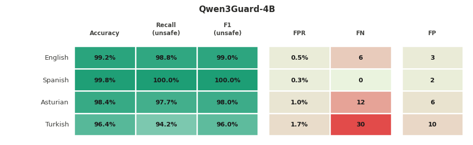
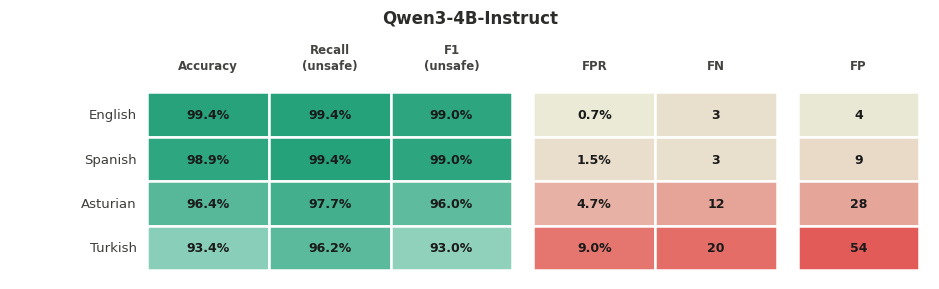

# Evaluating the Impact of Low-Resource Languages on Safety Alignment

**Bersun Şipal, Inés Martínez Fernández**

This project evaluates whether LLM-based safety classifiers maintain their performance when prompts are translated into typologically diverse languages and tests the effect of prefix injection jailbreaking (Wei et al., 2023) across all languages.

## Data

## Machine translation

## Evaluation

## Results

